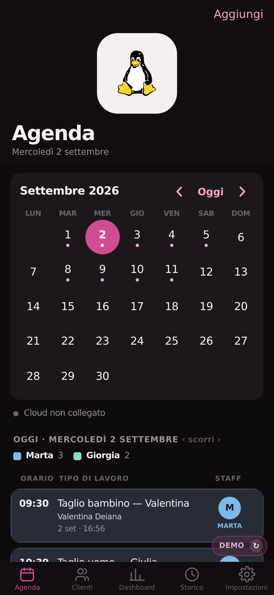
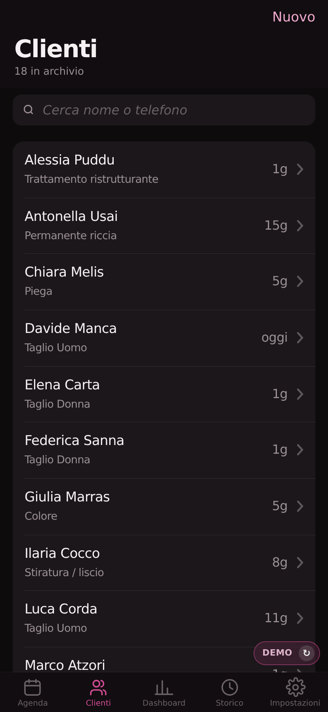
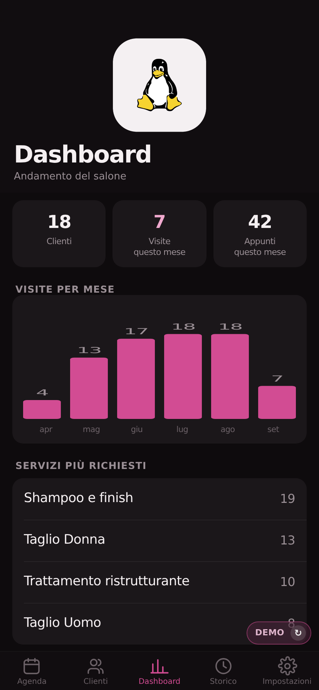
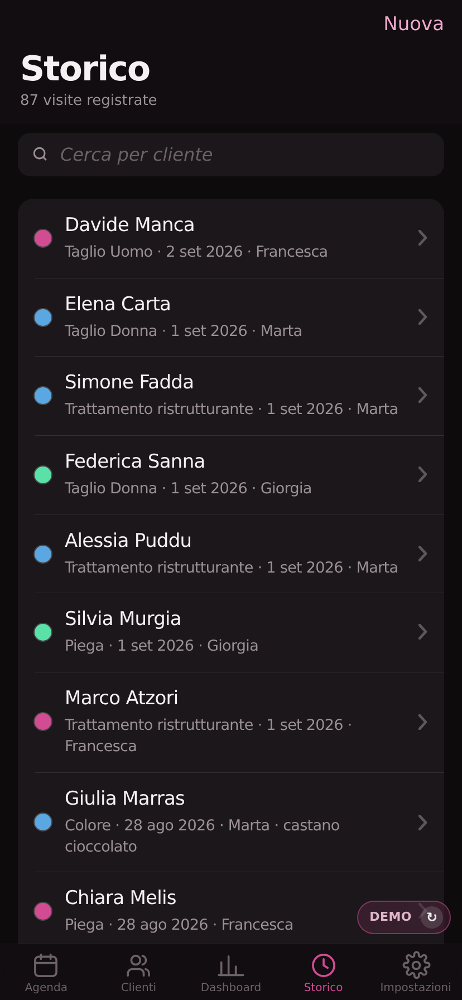

# Offline-First Salon CRM

A client register and appointment book built on commission for a hair salon, and used daily by its owner. It runs as an installable PWA on a phone, works with no connection at all, and syncs across devices through a serverless function.

**[▶ Live demo](#)** — seeded with entirely fictional data. **[Screenshots](#screenshots)**

> This repository is a rebranded, demo-seeded copy of a delivered project. The client's branding and every real client record have been removed: all names, phone numbers and appointments you see are invented.

---

## The problem

For sixteen years the salon kept its client history on paper: colour formulas, developer volume, processing time, allergies, who did the job, spread across binders and appointment books. Finding "what did we use on her last March?" meant leafing through one of them while the client waited. Off-the-shelf booking platforms charged a monthly fee plus commission and pushed the salon's own returning clients through a marketplace.

The brief was narrow: it had to work on one phone, in a basement with poor reception, without a login every morning, and it had to be readable by someone who does not use computers for a living.

## What it does

- **Appointment book** — day and month views, staff colour-coded, notes with an edit history
- **Client records** — contacts, birthdays, allergies and warnings, free-text notes, per-client comment thread
- **Service history** — colour used, brand, shade code, developer volume, processing time, who performed it
- **Dashboard** — activity at a glance
- **Printable day sheets** — the salon still wants paper at the front desk
- **Backup and restore** — JSON export, plus rotating server-side backups

## How it is built

Plain HTML, CSS and JavaScript in a single file. No framework, no build step, no bundler — the whole application is one document the client can be handed as a file.

**Offline first.** A service worker caches the shell (network-first for the document, cache-first for assets) so the app opens instantly and keeps working with no signal. All data lives in `localStorage`; the network is never on the critical path.

**Sync without a database.** A Netlify Function holds the only credentials and reads and writes a single JSON file on the owner's Google Drive. There is no server to run and no database to pay for.

**Conflict resolution.** Records merge field-by-field on `updatedAt`, last write wins. Deletions are tombstones (`deleted: true`) so they propagate like any other change instead of resurrecting on the next sync.

**Guards that matter more than features.** The owner is working through sixteen years of binders and typing that history into the app by hand. That changes what a bug costs: the expensive failure here is not a broken screen, it is silently losing work that took months to enter and cannot be re-created.

- *Anti-wipe guard* — a save that would shrink the live record count by more than half is rejected with HTTP 409 rather than committing. One bad sync from a half-loaded device should not erase months of manual data entry.
- *Rotating backups* — every write archives the previous state, keeping the last ten.
- *Pending-write flag* — survives app closure, so a phone that goes offline overnight still knows it owes the cloud an update.
- *Request timeouts* — `AbortController` plus a race, because on a weak connection a `fetch` can hang forever and silently freeze sync.
- *Escaped output* — everything the user types is escaped before it reaches the DOM.

## Stack

| | |
|---|---|
| Front end | Vanilla JS (ES5-compatible), CSS custom properties, no dependencies |
| Offline | Service Worker, Cache API, `localStorage` |
| Backend | Netlify Functions (Node) |
| Storage | Google Drive API v3, single JSON document |
| Auth | Shared passphrase, verified server-side; credentials never reach the client |

## Running it

```bash
git clone https://github.com/Andrioskij/offline-first-salon-crm
cd offline-first-salon-crm
npx serve public
```

The demo works fully offline — cloud sync stays disabled unless the environment variables below are set.

To deploy your own instance with sync, set these on Netlify and flip `DEMO = false` in `public/index.html`:

```
GOOGLE_CLIENT_ID
GOOGLE_CLIENT_SECRET
GOOGLE_REFRESH_TOKEN
APP_PASSWORD
```

## Screenshots

| Appointment book | Clients |
|---|---|
|  |  |

| Dashboard | Service history |
|---|---|
|  |  |

## Notes and limitations

- The UI ships in Italian and English (switchable in Settings); it was written for one salon, not built as a multi-locale product.
- A shared passphrase is the right amount of security for one owner and one device. It would not be for a multi-tenant product.
- Google Drive as a datastore is a deliberate trade: zero running cost and the owner keeps her own data, at the price of no queries and no concurrent writers.

## Licence

MIT — see [LICENSE](LICENSE).
